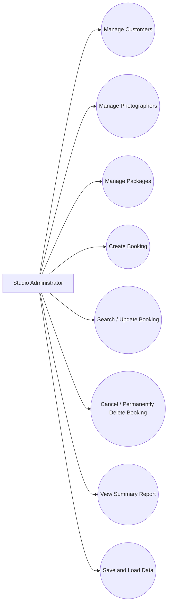
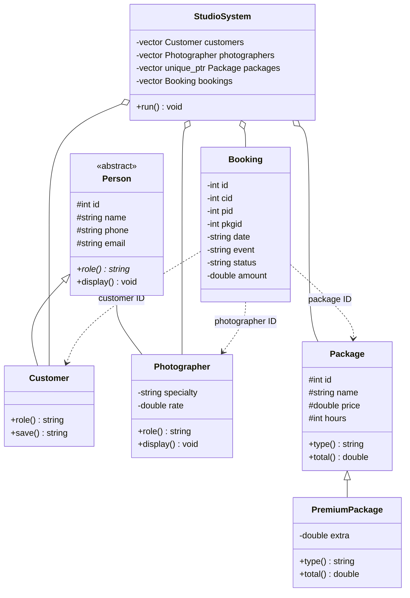
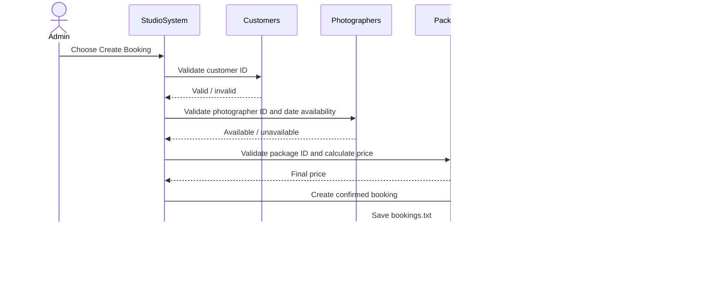
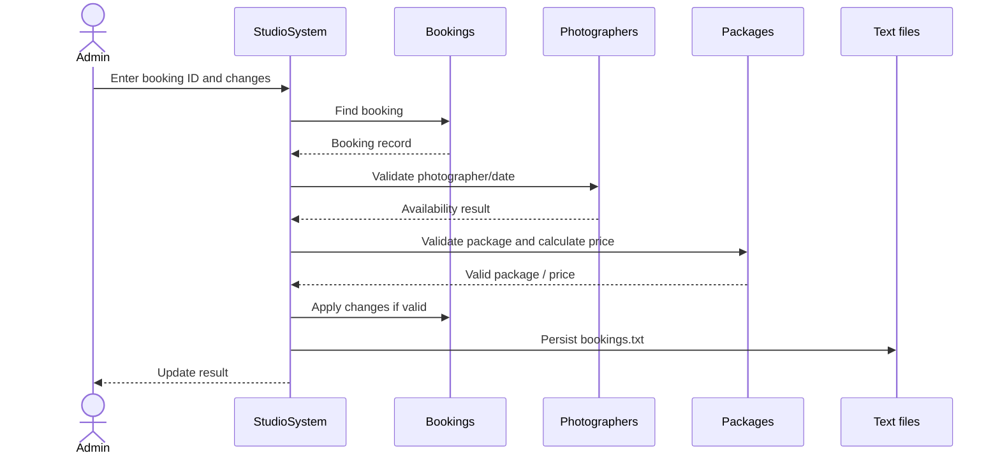

# UML diagrams

## 1. Use case diagram

```mermaid
flowchart LR
 Admin[Studio Administrator] --> C((Manage Customers))
 Admin --> P((Manage Photographers))
 Admin --> K((Manage Packages))
 Admin --> B((Create Booking))
 Admin --> S((Search / Update Booking))
 Admin --> X((Cancel / Permanently Delete Booking))
 Admin --> R((View Summary Report))
 Admin --> F((Save and Load Data))
```

## 2. Class diagram

```mermaid
classDiagram
 class Person {
  <<abstract>>
  #int id
  #string name
  #string phone
  #string email
  +role() string*
  +display() void
 }
 class Customer {
  +role() string
  +save() string
 }
 class Photographer {
  -string specialty
  -double rate
  +role() string
  +display() void
 }
 class Package {
  #int id
  #string name
  #double price
  #int hours
  +type() string
  +total() double
 }
 class PremiumPackage {
  -double extra
  +type() string
  +total() double
 }
 class Booking {
  -int id
  -int cid
  -int pid
  -int pkgid
  -string date
  -string event
  -string status
  -double amount
 }
 class StudioSystem {
  -vector Customer customers
  -vector Photographer photographers
  -vector unique_ptr Package packages
  -vector Booking bookings
  +run() void
 }
 Person <|-- Customer
 Person <|-- Photographer
 Package <|-- PremiumPackage
 StudioSystem o-- Customer
 StudioSystem o-- Photographer
 StudioSystem o-- Package
 StudioSystem o-- Booking
 Booking ..> Customer : customer ID
 Booking ..> Photographer : photographer ID
 Booking ..> Package : package ID
```

## 3. Sequence diagram — create booking

```mermaid
sequenceDiagram
 actor Admin
 participant App as StudioSystem
 participant C as Customers
 participant P as Photographers
 participant K as Packages
 participant B as Bookings
 participant F as Text files
 Admin->>App: Choose Create Booking
 App->>C: Validate customer ID
 C-->>App: Valid / invalid
 App->>P: Validate photographer ID and date availability
 P-->>App: Available / unavailable
 App->>K: Validate package ID and calculate price
 K-->>App: Final price
 App->>B: Create confirmed booking
 App->>F: Save bookings.txt
 App-->>Admin: Display confirmation
```

## 4. Sequence diagram — update booking

```mermaid
sequenceDiagram
 actor Admin
 participant App as StudioSystem
 participant B as Bookings
 participant P as Photographers
 participant K as Packages
 participant F as Text files
 Admin->>App: Enter booking ID and changes
 App->>B: Find booking
 B-->>App: Booking record
 App->>P: Validate photographer/date
 P-->>App: Availability result
 App->>K: Validate package and calculate price
 K-->>App: Valid package / price
 App->>B: Apply changes if valid
 App->>F: Persist bookings.txt
 App-->>Admin: Update result
```
